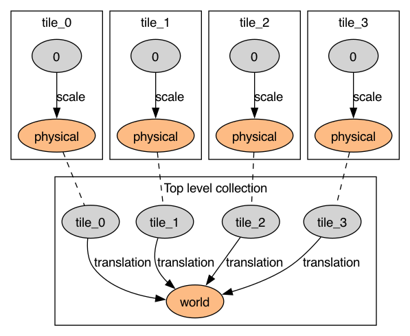

# OME-Zarr RFC-5 example transform graphs

Transform graphs for the examples at https://github.com/jo-mueller/ngff-rfc5-coordinate-transformation-examples/tree/dev1-revision.

See the `graphs` folder for the graphs; here's one of them:

